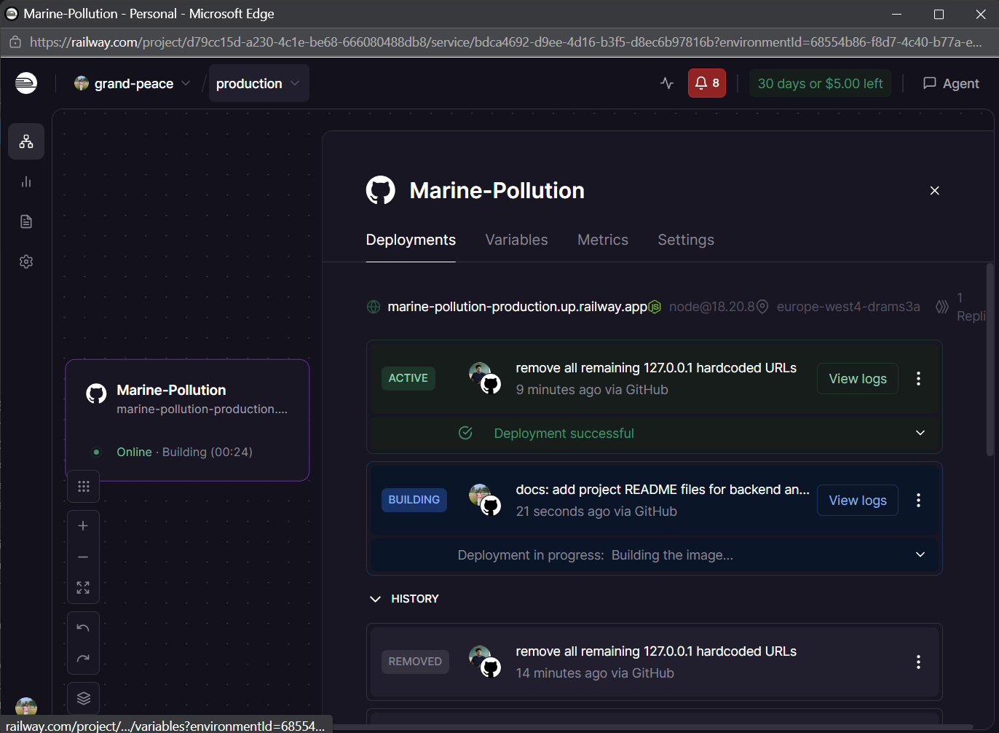
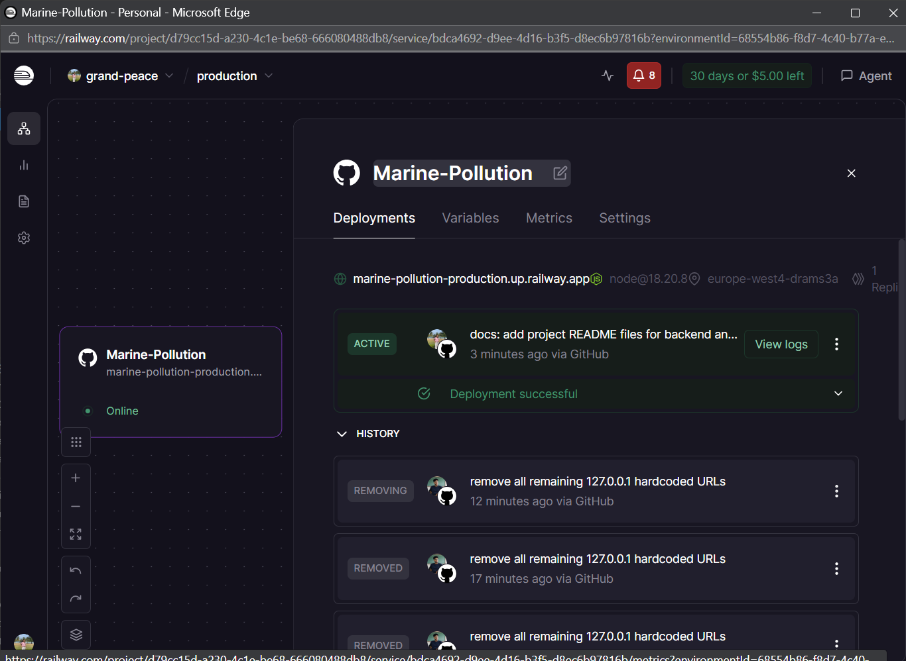

# Marine Pollution Dashboard - Backend

This is the backend for the Marine Pollution Dashboard, a platform designed to track pollution, coordinate cleanups, and reward community reporting using AI.

## Technologies
- **Node.js** & **Express** - Fast, unopinionated, minimalist web framework.
- **MongoDB** & **Mongoose** - Document database and ODM.
- **OpenAI API** - AI-powered pollution description from photos.
- **Socket.io** - Real-time notifications for cleanup tasks.
- **JWT** - Secure authentication.
- **Artillery.io** - Performance and load testing.
- **Jest** & **Supertest** - Comprehensive Unit and Integration testing.

## Key Features
- **Cleanup Task Management**: Create, assign, and track progress of pollution cleanup tasks.
- **Volunteer Management**: Maintain a roster of volunteers with skills and availability.
- **Community Reporting**: Anonymous or registered users can report pollution with photos.
- **AI Description Generation**: Automatically generate detailed pollution reports using GPT-4 Vision.
- **Achievements & Leaderboard**: Reward volunteers with points and badges for their contributions.

## Setup Instructions

### 1. Prerequisites
- [Node.js](https://nodejs.org/) (v16+)
- [MongoDB Atlas](https://www.mongodb.com/cloud/atlas) or a local MongoDB instance.

### 2. Installation
Navigate to the `backend` directory:
```bash
cd backend
npm install
```

### 3. Environment Variables
Create a `.env` file in the `backend` root based on `.env.example`:
```bash
cp .env.example .env
```
Fill in the following mandatory variables:
- `MONGO_URI`: Your MongoDB connection string.
- `JWT_SECRET`: A secret key for signing tokens.
- `OPENAI_API_KEY`: Required for AI report generation.

### 4. Running the Server

**Development Mode (with auto-reload):**
```bash
npm run dev
```

**Production Mode:**
```bash
npm start
```
The server will be available at `http://localhost:5000`.

## Testing
The backend uses **Jest** and **Supertest** for testing.

### 1. Unit Testing
Unit tests focus on the logic of individual controllers and database models.
```bash
npm test __tests__/unit/
```

Individual Controller Tests:
- **Achievement Controller**: `npm test __tests__/unit/achievement.controller.test.js`
- **Community Report Controller**: `npm test __tests__/unit/chReport.controller.test.js`
- **Task Controller**: `npm test __tests__/unit/task.controller.test.js`
- **Volunteer Controller**: `npm test __tests__/unit/volunteer.controller.test.js`

Model Validations:
- **Achievement Model**: `npm test __tests__/achievement.model.test.js`
- **User Model**: `npm test __tests__/user.model.test.js`

### 2. Integration Testing
Integration tests ensure the API and database work together as expected.
```bash
npm test __tests__/integration/
```

Individual API Tests:
- **Achievement Management**: `npm test __tests__/integration/achievement.api.test.js`
- **Community Reporting**: `npm test __tests__/integration/chReport.api.test.js`
- **Cleanup Tasks**: `npm test __tests__/integration/task.api.test.js`
- **Volunteer Roster**: `npm test __tests__/integration/volunteer.api.test.js`

### 3. Performance Testing
We use **Artillery.io** to simulate heavy traffic and ensure API stability under load:
```bash
npm install --save-dev artillery
npm run test:perf
```
*Note: Ensure the server is running before executing performance tests.*

## Complete API Reference
The platform exposes a comprehensive RESTful API. Below is the full list of available endpoints. For interactive documentation including request/response schemas, visit `http://localhost:5000/api-docs`.

### Authentication & Users
- `POST /api/auth/register` - Create a new user (admin, volunteer, or manager).
- `POST /api/auth/login` - Authenticate and receive a JWT.
- `GET /api/auth/profile` - Retrieve current core user details.
- `GET /api/ch/users/me` - Get detailed community profile.
- `PATCH /api/ch/users/me` - Update community profile (bio, phone, etc.).
- `POST /api/ch/users/me/profile-pic` - Upload/update profile photo.

### Volunteer Management
- `GET /api/volunteers` - List all registered volunteer profiles.
- `POST /api/volunteers` - Register a new volunteer identity.
- `PUT /api/volunteers/:id` - Update volunteer skills and availability.
- `DELETE /api/volunteers/:id` - Remove a volunteer profile (Admin only).

### Achievements & Leaderboard
- `GET /api/achievements` - Admin list of all submissions.
- `GET /api/achievements/my-achievements` - List for the logged-in user.
- `GET /api/achievements/leaderboard` - Global volunteer points ranking.
- `GET /api/achievements/stats` - Global achievement metrics.
- `POST /api/achievements/submit` - Submit a new activity for approval.
- `PATCH /api/achievements/:id/approve` - Approve and award points.
- `PATCH /api/achievements/:id/reject` - Reject a submission.

### Cleanup Tasks (Management Hub)
- `GET /api/tasks` - List all tasks (supports `status` & `manager` filters).
- `POST /api/tasks` - Create a new cleanup task.
- `PATCH /api/tasks/:id` - Update task metadata.
- `DELETE /api/tasks/:id` - Remove a cleanup record.
- `POST /api/tasks/:id/assign` - Assign a volunteer to a task.
- `POST /api/tasks/:id/accept` - Accept assignment (Volunteer only).
- `POST /api/tasks/:id/complete` - Mark task as finished.

### Community Reporting
- `POST /api/ch/reports` - Create a new report draft (Photo required).
- `GET /api/ch/reports/my` - List reports by the current user.
- `GET /api/ch/reports/all/published` - Public verified reports.
- `POST /api/ch/reports/:id/publish` - Verify and make report public.
- `POST /api/ch/reports/:id/ai/generate` - Trigger AI pollution analysis.
- `DELETE /api/ch/reports/:id` - Delete a report instance.

### Utility & Extras
- `GET /api/extras/quote` - Get a random motivational quote.
- `GET /api/extras/fact` - Get a random marine biology fact.
- `GET /health` - Service heartbeat and system status.

---

## Interactive Documentation
Once the server is running, explore the full specification and test endpoints directly via the Swagger UI: http://localhost:5000/api-docs


# Deployment Guide

This guide explains how to deploy the Marine Pollution Management Hub.

## Backend: Deployment on Railway

1.  **Preparation**:
    *   Ensure your code is pushed to a GitHub repository.
2.  **Steps**:
    *   Log in to [Railway](https://railway.app/).
    *   Click **"New Project"** -> **"Deploy from GitHub repo"**.
    *   Select this repository.
    *   Railway will detect the `backend` folder if you set the **Root Directory** to `backend` in the settings.
3.  **Variables**:
    *   Set the following Environment Variables in Railway:
        *   `MONGO_URI`: Your MongoDB Atlas connection string.
        *   `JWT_SECRET`: A long random string.
        *   `ADMIN_REGISTER_KEY`: Key for admin registration (e.g., `1234`).
        *   `OPENAI_API_KEY`: Your OpenAI API key.
        *   `NODE_ENV`: `production`.
        *   `FRONTEND_URL`: Your Vercel URL (add this *after* deploying frontend).



