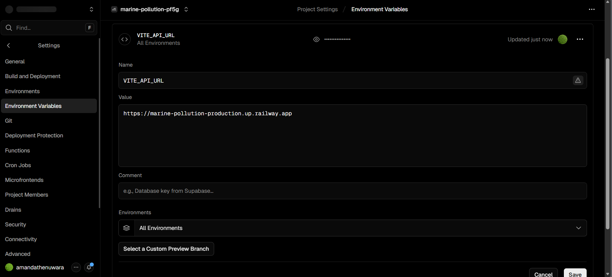
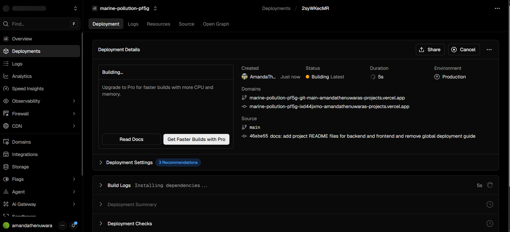
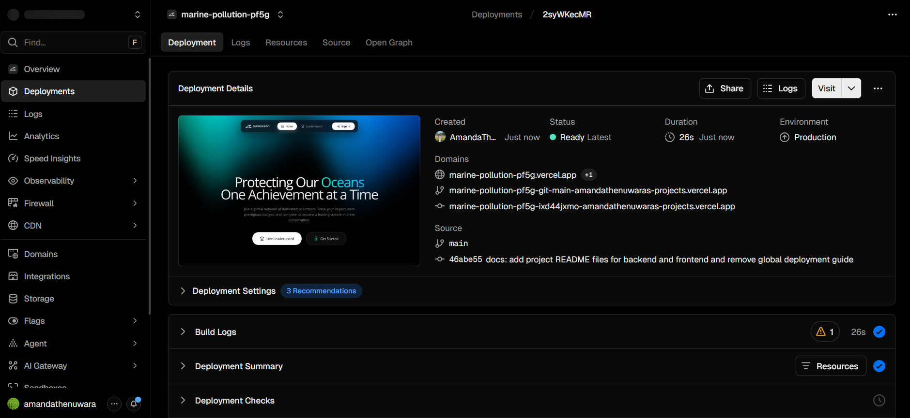

# Marine Pollution Dashboard - Frontend

A modern, interactive dashboard for visualizing marine pollution, managing cleanups, and submitting community reports.

## Technologies
- **React 19** & **Vite** - Lightning-fast frontend development and building.
- **Tailwind CSS** - Utility-first styling with modern design principles.
- **Framer Motion** - Smooth animations and premium micro-interactions.
- **Leaflet** & **MapLibre GL** - Interactive mapping for pollution tracking.
- **Socket.io-client** - Real-time updates and notification handling.
- **Radix UI** - Accessible, unstyled primitives for custom UI components.

## Key Sections
- **Interactive Map**: View real-time pollution data and cleanup task locations.
- **Management Hub**: Tooling for admins to assign cleanup tasks to volunteers.
- **Community Reports**: Reporting interface with photo upload and AI status tracking.
- **Achievements**: Gamified volunteer experience with Tier-based evolution cards.

## Setup Instructions

### 1. Prerequisites
- [Node.js](https://nodejs.org/) (v18+)
- [npm](https://www.npmjs.com/)

### 2. Installation
Navigate to the `frontend` directory:
```bash
cd frontend
npm install
```

### 3. Environment Variables
Create a `.env` file in the `frontend` root based on `.env.example`:
```bash
VITE_API_URL=http://localhost:5000
VITE_SOCKET_URL=http://localhost:5000
```

### 4. Running the Development Server
```bash
npm run dev
```
The application will be available at `http://localhost:5173`.

### 5. Building for Production
```bash
npm run build
```

## Testing
The frontend utilizes **Vitest** for unit and integration testing.

### 1. Integration Testing
Integration tests verify how different components, services, and state management work together.
```bash
npm test src/__tests__/integration/ -- run
```

To run a specific module integration test:
- **Volunteer Hub**: Tests registration and profile management.
  `npm test src/__tests__/integration/VolunteerHub.integration.test.jsx`
- **Achievement Hub**: Tests stats, filters, and admin approvals.
  `npm test src/__tests__/integration/AchievementHub.integration.test.jsx`
- **Pollution Dashboard**: Tests task filtering and location searching.
  `npm test src/__tests__/integration/Dashboard.integration.test.jsx`
- **Report Details**: Tests AI generation and report publication.
  `npm test src/__tests__/integration/ReportDetails.integration.test.jsx`

### 2. Unit & Form Validation Tests
Unit tests focus on individual component behavior and form validation logic.
```bash
npm test src/components/__tests__/ -- run
```

To run a specific component test:
- **Task Management**: `npm test CreateTaskModal.test.jsx` or `UpdateTaskModal.test.jsx`
- **Volunteers**: `npm test VolunteerForm.test.jsx` or `VolunteerCard.test.jsx`
- **Achievements**: `npm test AchievementForm.test.jsx`

### 3. Coverage Report
Generate a detailed test coverage report:
```bash
npm run test:coverage
```

## UI/UX Philosophy
- **Rich Aesthetics**: Vibrant gradients, dark modes, and soft shadows for a premium feel.
- **Responsiveness**: Fully fluid design optimized for mobile, tablet, and desktop viewports.
- **Interactivity**: Micro-animations on hover and layout transitions to keep users engaged.


# Deployment Guide

## Frontend: Deployment on Vercel

1.  **Preparation**:
    *   Ensure your code is pushed to a GitHub repository.
2.  **Steps**:
    *   Log in to [Vercel](https://vercel.com/).
    *   Click **"Add New"** -> **"Project"**.
    *   Import your GitHub repository.
    *   **Root Directory**: Set this to `frontend`.
    *   **Framework Preset**: Select `Vite` (it should auto-detect).
3.  **Variables**:
    *   Add the following Environment Variable:
        *   `VITE_API_URL`: Your full Railway backend URL (e.g., `https://marine-pollution-production.up.railway.app`).
        *   *Note: Do NOT include `/api` at the end of `VITE_API_URL`.*

---




## Important Notes

*   **CORS**: The backend is configured to allow requests from your `FRONTEND_URL`. Make sure to set this variable in Railway once you have your Vercel URL.
*   **Root Directories**: Since this is a monorepo, it is **critical** to set the "Root Directory" correctly on both platforms (`backend` for Railway, `frontend` for Vercel).
*   **Static Files**: Images uploaded via `multer` are stored in the `backend/uploads` folder. Since Railway has an ephemeral filesystem, images will be lost when the service restarts. For production, consider using a cloud storage provider like Cloudinaryy.
